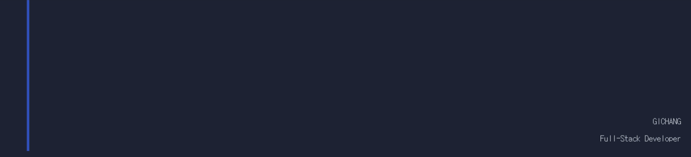

---

<h3>
   About Me
</h3>

- 🔭 **Full-Stack Developer** focused on Backend & AI/Search
- 🌱 Currently working with **Spring Boot, FastAPI, LangChain**
- ⚡ Interested in **RAG pipelines, Vector Search, LLM serving**
- 📫 Reach me at **imgc@warebiz.co.kr**
- 🌐 Blog: [rlckdwkd55.github.io](https://rlckdwkd55.github.io) &nbsp;|&nbsp; Portfolio: [rlckdwkd55.github.io/portfolio](https://rlckdwkd55.github.io/portfolio)

  

<!-- Activity Graph -->

  

---

<h3>
   Skills
</h3>

  
<strong> Language </strong> (click to expand)

   

  
  
  
  

   

  
<strong> Backend </strong> (click to expand)

   

  ###### Java
  > 
  > 
  > 
  > 

  ###### Python
  > 
  > 

  ###### Node
  > 

   

  
<strong> Frontend </strong> (click to expand)

   

  ###### Framework
  > 
  > 

  ###### State & Style
  > 
  > 

   

  
<strong> AI & Search </strong> (click to expand)

   

  ###### LLM & RAG
  > 
  > 
  > 
  > 

  ###### Search & Vector DB
  > 
  > 

   

  
<strong> Database </strong> (click to expand)

   

  
  
  
  

   

  
<strong> Infra & Tools </strong> (click to expand)

   

  ###### Container & CI/CD
  > 
  > 
  > 

  ###### Build & Cloud
  > 
  > 
  > 

  ###### Version Control
  > 
  > 

   

---

<h3>
   Projects
</h3>

  
<strong> Web & Backend </strong> (click to expand)

   

  > 

   

  
<strong> AI & Search </strong> (click to expand)

   

  > 

   

---

### 🔗 Connect with me

    
    
    

 

### 📄 Employer?

> [!IMPORTANT]
> <a href="https://drive.google.com/file/d/16-HlWYoGXVdmd4eseBkchdKezt2W2pIP/view?usp=sharing">Download my resume</a>

 

  

Created with ❤️ by Gichang

